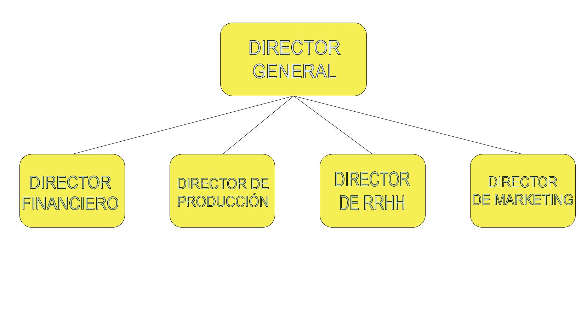

En esta nueva era en la que es imperativo tener un ordenador para poder trabajar, el público generalmente desconoce las especificaciones técnicas que debe tener un dispositivo que se ajuste a sus necesidades y no pague de más por funciones o capacidades que no utilizará en la vida. Al igual, la configuración de los mismos no es tarea fácil.

Desde TecnoT8 queremos llevar nuestros conocimientos en el mundo de la informática a un público no formado con la idea de que puedan disfrutar al máximo de sus ordenadores.

Si acabas de incorporarte a TecnoT8, Te damos la bienvenida. Queremos que este manual sea una forma sencilla para que puedas integrarte lo mejor posible en el entorno de trabajo y junto a nosotros puedas crecer a un más.

Gracias por elegirnos.

***

### Espítiru y motivaciones

*   Misión: Usar nuestros conocimientos para que la persona de a pié pueda disfrutar de la mejor experiencia en nuestro mundo.

*   Ejecución: Lograr un entorno cómodo y productivo a partes iguales. Buscar el balance entre ambas. Pensar siempre en la comodidad del usuario

*   Resultados: Lograr que el producto final sea un orgullo para todos. Somos un equipo y nuestro objetivo es el mismo.

***

### Equipo

- Morante Caraballo, Abel

- Caballero Domínguez, Ángel

- Cadenas Sánchez, María Jesús

- Correa López, Florentina

- Fernández Fernández, Adrián

- Granja Naranjo, Javier

***

### Organización

Nuestra empresa se divide en:
Director@ general: Define objetivos, planifica, organiza y toma las decisiones de la empresa.
Director@ financiero: Gestiona las tareas administrativas,financieras, informes, presupuestos e inversiones.
Director@ de producción: Gestiona el tiempo, supervisa el trabajo de los empleados, gestiona los recursos materiales y técnicos.
Director@ de recursos humanos: Realiza el reclutamiento y selección de los trabajadores y los forma, gestiona la comunicación interna, motiva y coordina los equipos.
Director@ de marketing: Diseña estrategias, ofertas, servicios, elabora presupuestos en su departamento y gestiona las comunicaciones en redes sociales.

Organigrama:

### Vacaciones

Este es el calendario de vacaciones mayores que recogemos en TecnoT8 sin incluir las fiestas de cada región.

***

### Derechos y Deberes

Como deber de empresario 

*   El empresario asume una serie de obligaciones en la relación laboral.

Como deberes de nuestros trabajadores se encuentran: 

*   Cumplir con las obligaciones concretas del puesto de trabajo, de conformidad con lo establecido.

*   Cumplir las medidas de seguridad e higiene que se adopten y con las medidas de prevención de riesgos laborales por lo que se refiere a las obligaciones de los trabajadores.

*   A cumplir las órdenes e instrucciones del empleador, siempre que las órdenes o instrucciones no sean abusivas o ilegítimas.

*   No concurrir con la actividad de la empresa sin entrar un perjuicio con la persona del empleador.

*   Contribuir a la mejora de la productividad. 

***

### Horarios

Entendemos que en la vida tienes algo más que hacer a parte de trabajar por eso no te vamos a imponer un horario extricto que debas seguir. Creemos que este dinamismo te ayudará gestionarte mejor y acabar la jornada de trabajo habiendo dado lo mejor de ti.

¡Eso si!, deberás cumplir las horas por día que estipula tu contrato y chequear tu acceso a través de IntraTime.

Si tienes algún problemas respecto a tu ajuste de horas o necesitas hacer algún cambio en la distribución, contacta con Flor que estará encantada de atenderte.

***

### Normas de Convivencia

*   Escuchar y respetar las ideas y opiniones de los demás, permitiendo una interacción equitativa y justa para todos

*   Propender por el cumplimiento de normas como medio para una convivencia productiva

*   Respetar a los demás como individuos y valorar su conocimiento y potencial como miembros y compañeros de trabajo

*   Brindar un trato gentil, respetuoso y amable con los compañeros de trabajo

*   No divulgar información privada y personal de los compañeros de trabajo

*   Respetar la intimidad y la privacidad, y no utilizar las claves de ingreso de otros compañeros al sistema de la empresa

*   Evitar lanzar juicios y generar comentarios que pueden afectar el equipo de trabajo

*   Ser solidarios ante situaciones que no tengan que ver con nuestras funciones específicas pero que estamos en la capacidad de brindar apoyo para que el compañero supere la situación.

*   Respetar y valorar el tiempo de los demás, evitando interrumpir innecesariamente las labores de todos

***

### ¿Cómo se realiza el trabajo?

La incorporación al puesto de trabajo requiere algunas actividades previas y necesarias:

- Rellenar la “Tarjeta de incorporación”, documento interno donde están todos los datos personales necesarios para la relación laboral.

- Copia de los siguientes documentos personales: documento de identidad, afiliación a la Seguridad Social, modelo 145, certificado negativo de delitos de naturaleza sexual y cualquier otro de carácter oficial que acredite profesional y/o formativamente.

-  Formalizar el contrato de trabajo que recoge el lugar de trabajo, categoría, horario y salario, así como otras condiciones más específicas de TecnoT8 con su personal.

- Atender a la formación inicial, facilitada por sus responsables inmediatos, imprescindible para desempeñar el puesto de trabajo y sus responsabilidades.

***

### Instalaciones

Queremos que nuestras oficinas sean un espacio al que quieras venir a trabajar así que buscamos la mayor comodidad posible. Mantenemos una zona de descanso y ocio cerca del lugar de trabajo como motivación y accesibilidad. Puedes mezclar los sabores como más te guste

Es verdad que fomentamos el uso del teletrabajo pero debemos tener un sito alternativo al que acudir si es necesario. La comodidad de casa puede resultar contraproducente por eso, tu eliges que entorno te beneficia más y cuando.

***

### Contacto

Escuela Técnica Superior de Ingeniería Informática

Universidad de Sevilla

Av. Reina Mercedes s/n,
41012 Sevilla

Teléfono: 954556817

secretaria-eii@listas.us.es
